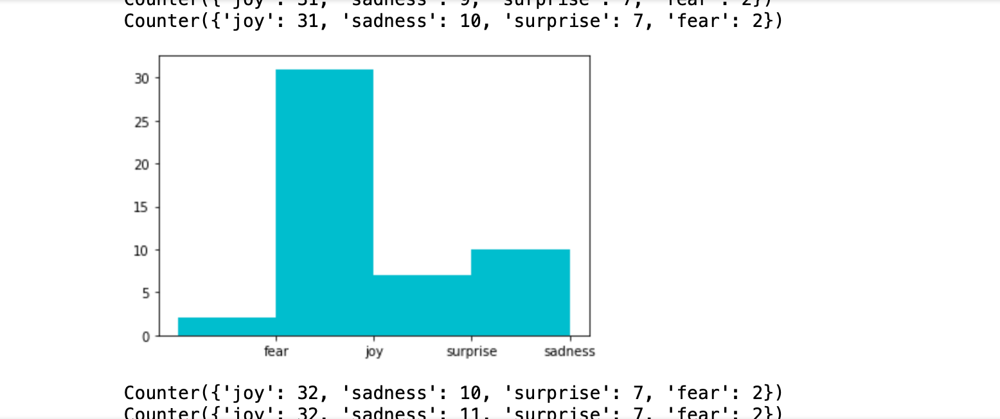

# LiveEmotionAnalysisTwitterSpark
Live Emotion NLP analysis with <a href="https://nlp.johnsnowlabs.com">Spark NLP(John Snow Labs), Tweepy and Apache Spark</a>.  by <a href="https://www.linkedin.com/in/davidnallapu">David Nallapu</a>.

 

  <h3 align="center">Live Emotion Analysis of Twitter with Spark </h3>

     <ul<Functionalities include :
     <li>Filter out tweets containing a particular word.</li> 
<li>Filter out tweets based on laguage</li> 
<li>Get a freuency count of Emotions and a graph </li> 
     </ul>

     
  

<!-- TABLE OF CONTENTS -->
## Table of Contents

* [About the Project](#about-the-project)
* [Getting Started](#getting-started)
* [Usage](#usage)

<!-- ABOUT THE PROJECT -->
## About The Project

<!-- GETTING STARTED -->
## Getting Started

To get a local copy up and running, 
1. Clone the git repository. 
2. Install Java 8, Jupyter Notebook, PySpark, and Tweepy 
3. Change os.environ["JAVA_HOME"] in SparkEmotionAnalysisTwitter.ipynb with your JAVA HOME directory. 
4. Create a Twitter Developer account on apps.twitter.com and enter your credentials in TweetRead.py(consumer_key ,consumer_secret, access_token ,access_secret)

<!-- USAGE EXAMPLES -->
## Usage
First open the terminal and go to the directory. 
1. Enter the term you want that all the tweets will have in TweetRead.py. Run TweetRead.py 
2. Run alll cells on SparkTwitterStreaming.ipynb on Jupyter Notebook
3. Run SparkEmotionAnalysisTwitter.ipynb

 

